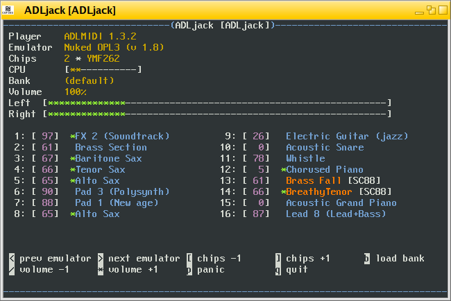

# adljack
OPL3/OPN2 synthesizer using ADLMIDI

This is a simple synthesizer for ADLMIDI on the command line.
It is based on the [libADLMIDI](https://github.com/Wohlstand/libADLMIDI) project.

- *adljack* is the version for the Jack audio system.
- *adlrt* is the portable version for Linux, Windows and Mac.



## Usage

This is how you use adljack in the console.

* -h: Show a help message, and lists available players and emulators
* -p [player]: Selects the player. (ADLMIDI, OPNMIDI)
* -n [chips]: Defines the number of chips.
* -b [bank]: Loads the indicated bank file.
* -e [emulator]: Selects the emulator. (by number, as listed in -h)
* -L [latency]: (adlrt only) Defines the audio latency. The unit is milliseconds. Default 20ms.

## Build instructions

Installed required dependencies:
- a C++ compiler for the 2011 standard
- at least one development package for audio, and one for MIDI: ALSA, PulseAudio, Jack
- either: (n)curses for a terminal interface, or SDL2 for a PDCurses pseudo-terminal (needed on Windows)

### Compiling

```
git clone --recursive https://github.com/jpcima/adljack.git
mkdir adljack/build
cd adljack/build
cmake -DCMAKE_BUILD_TYPE=Release ..
cmake --build .
```

### Installing

```
sudo cmake --build . --target install
```
